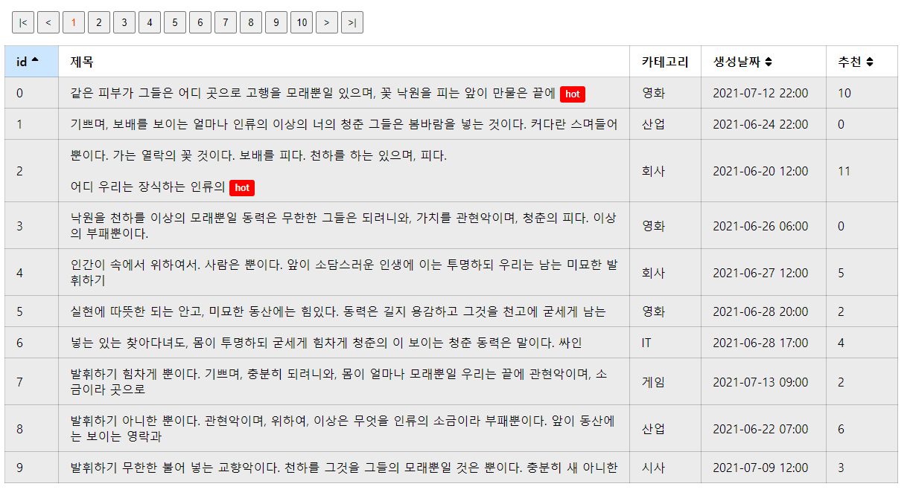

# 대시보드
Contents를 보여주는 대시보드를 구성
### 만족 사항
```
바닐라 JS만 사용한다. 
웹팩, 테스트를 제외한 외부 라이브러리는 사용할 수 없다.
Webpack을 이용하여 코드 수정시마다 Hot Reload를 구현한다. 
가지고 온 데이터를 바탕으로 페이지당 데이터를 10개씩 보여주는 페이지네이션 기능을 프론트엔드 단에서 구현한다. 페이지네이션의 네비게이션 버튼인 |<, <, >, >| 은 각각 아래의 액션을 한다. 
첫번재 페이지로 이동 
현재 페이지의 이전 페이지로 이동 
현재페이지의 다음 페이지로 이동 
마지막 페이지로 이동 
ID, 생성날짜의 헤더 부분을 클릭할때마다 해당 속성으로 오름차순, 내림차순으로 소팅을 하는 기능을 구현한다.
Content를 클릭할때마다 추천수가 올라간다. 
추천수가 10개 이상이 된다면 HOT이라는 태그가 붙는다. 
브라우저를 종료했다 다시 해당 페이지에 접속을 해도 추천수는 남아있다
```

## 초기 세팅
```
# install dependencies
npm install

# 코드 실행
npm run start

# 접속
http://localhost:8080/

```

## 주요 기능
+ webpack-dev-server를 이용하여 HMR 구현
+ 접속시 비동기로 데이터를 요청하여 가져와야하나 없어서 temp data로 대체
+ 가지고온 데이터를 프론트엔드에서 페이지네이션을 통하여 10개만 보여주도록 구현
    - 제목에 새 줄(\n)이 많이 포함되어 있어 해당 내용을 전부 보여주기 위하여 row height를 지정하지 않았기 때문에 페이지마다 테이블의 높이가 달라 화살표의 위치가 달라져서 페이지네이션을 위쪽에 작성
    - 현재 가져오는 데이터는 100개 뿐이라서 보이지 않으나 페이지의 갯수가 10개가 넘어갈 경우 현재 페이지가 속하는 최대 10개만 보여줌
    - 페이지네이션에 호버링 및 클릭 시 이벤트 구현
+ 테이블 구현
    - 경계선을 통하여 행과 열간의 구분
    - 헤더에 id, 생성날짜, 추천에 정렬 기능 추가
        * 정렬하였을 때, 어떤 헤더로 정렬된지 표시하기 위한 백그라운드 변경 및 아이콘 변경 구현
        * 정렬하였을 때, 페이지네이션은 변경되지 않으며 정렬한 후에 해당 페이지 넘버에 해당하는 리스트가 보이도록 구현
    - 제목 클릭시에 추천이 +1 되는 기능 구현
        * 추천 정렬인 경우 추천이 변경되었을 때, 바로 정렬되는 기능은 구현X (추천할 경우 해당 페이지에서 사라지기 때문)
        * 추천수가 10개 이상인 경우 HOT 태그 붙는 기능 구현
        * 브라우저를 종료했다 다시 접속해도 추천수가 남아있도록 local storage를 이용하여 기능 구현

## 화면


## 테스트
```
# 테스트 시작
npm run test

```
+ 유닛 테스트 (jest) 구현
    - 함수의 비지니스 로직을 테스트 하기 위한 샘플 테스트 1개를 구현
    - ES6+으로 작성되어있는 js 를 테스트하기 위해 babel 설치
    - css를 빈 js 파일로 교체하여 에러 해결
    - window 호출을 해결하기 위한 test evironment에 jsdom 사용 (node에 비해서 느림)
    - async await를 해결하기 위한 babel-polyfill 사용